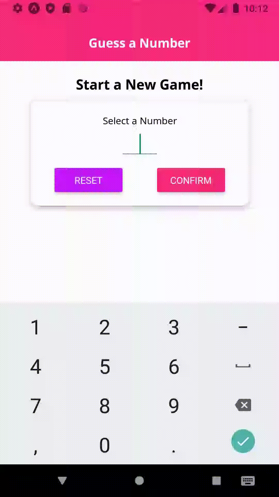
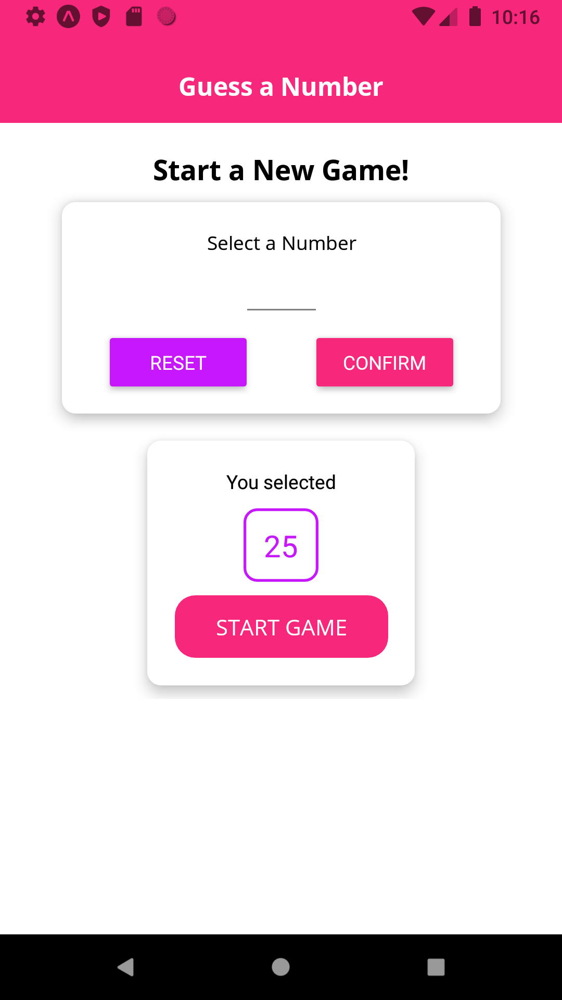
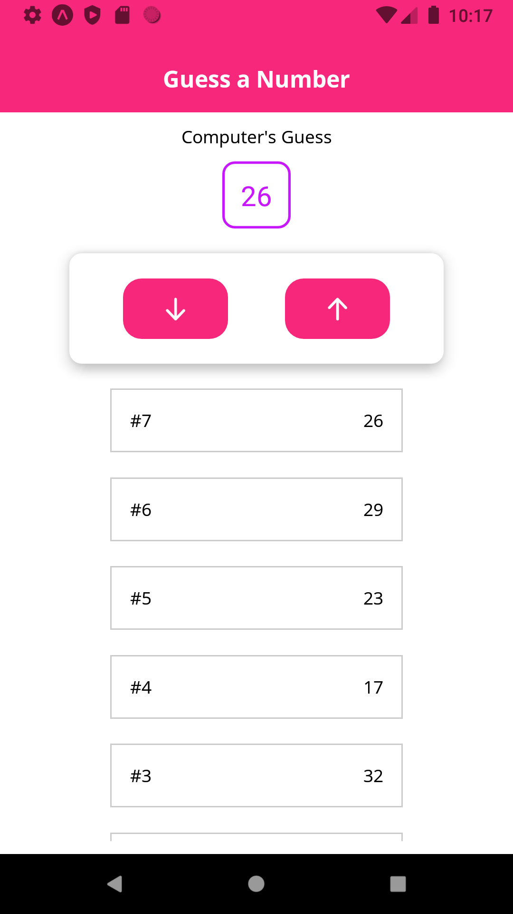

# Guess a Number
Android/IOS application developed with React Native that try to guess the user's number from 1 to 99 using the provided hints.

<h3>Demo:</h3>

<h3>Start Screen:</h3>

Pick a number from 1 to 99.

<h3>Game Screen:</h3>

Guide the computer to the right guess by selecting Higher or Lower.

<h3>End Screen:</h3>

Summarize the game by showing the attemps and the selected number. It also generate a random image for each victory.

 
